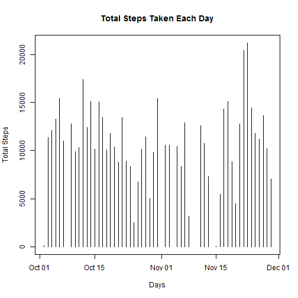
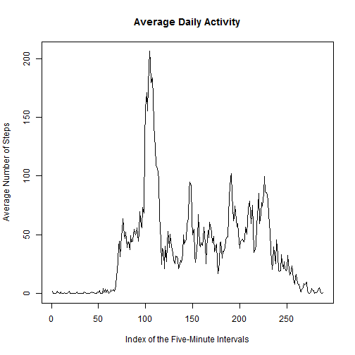
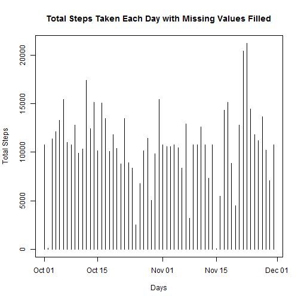
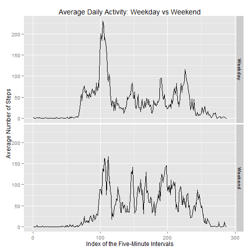

# Reproducible Research: Peer Assessment 1

Michael Zhao

## Loading and preprocessing the data
The data was first loaded in R using the read.csv function. Then I removed the missing values.

```r
data <- read.csv(unzip("activity.zip"))
fixeddata <- data[ ! is.na(data$steps), ]
```


## What is mean total number of steps taken per day?
Here is the code for plotting the total number of steps taken each day and for finding the mean and median of the number of steps taken each day.

```r
dailytotalsteps <- tapply( fixeddata$steps , fixeddata$date , sum)
dailytotalsteps <- dailytotalsteps[ ! is.na(dailytotalsteps)]

#mean and median
meandailytotalsteps <- mean(dailytotalsteps)
mediandailytotalsteps <- median(dailytotalsteps)

plot(
    x = as.Date( names( dailytotalsteps ) ),
    y = dailytotalsteps, 
    type="h", 
    main = "Total Steps Taken Each Day", 
    ylab = "Total Steps",
    xlab = "Days"
    )
```

 

The mean total number of steps taken per day was 1.0766 &times; 10<sup>4</sup>.

The median total number of steps taken per day was 10765.


## What is the average daily activity pattern?
Here is the code for plotting the average number steps taken for each interval and for finding the interval with the highest average.

```r
intervalmeansteps <- tapply( fixeddata$steps, fixeddata$interval, mean)

#interval with max steps
intervalwithmaxsteps <- names( intervalmeansteps[ intervalmeansteps == max( intervalmeansteps ) ] )

plot(
    intervalmeansteps,
    type = "l",
    main = "Average Daily Activity", 
    ylab = "Average Number of Steps",
    xlab = "Index of the Five-Minute Intervals"
    )
```

 

The five minute interval with the highest average number of steps is 835.

## Inputing missing values
This code calculates the total number of missing values in the dataset, replaces all of the missing values with the mean value of the five minute interval corresponding to the missing value, plots the new dataset, and calculates the new mean and median.

```r
#total number of missing values
missing <- sum( is.na( data$steps ) )

newdata <- data
#loops through the dataset and replaces all missing values 
for ( i in  1 : length( newdata$steps ) ) {
    if ( is.na( newdata$steps[ i ] ) ) {
        newdata$steps[ i ] <- intervalmeansteps[ as.character( data$interval[i] ) ]
    }
}

newdailytotalsteps <- tapply( newdata$steps , newdata$date , sum)
newdailytotalsteps <- newdailytotalsteps[ ! is.na(dailytotalsteps)]

#calculates mean and median
newmeandailytotalsteps <- mean(newdailytotalsteps)
newmediandailytotalsteps <- median(newdailytotalsteps)

plot(
    x = as.Date( names( newdailytotalsteps ) ),
    y = newdailytotalsteps, 
    type="h", 
    main = "Total Steps Taken Each Day with Missing Values Filled", 
    ylab = "Total Steps",
    xlab = "Days"
    )
```

 

The total number of missing values in the dataset is 2304.

The new mean total number of steps taken per day is 1.0766 &times; 10<sup>4</sup>.

The new median total number of steps taken per day was 1.0766 &times; 10<sup>4</sup>.

The mean remains unchanged while adding the missing values shifted the median.


## Are there differences in activity patterns between weekdays and weekends?

```r
newdata$weekdays <- weekdays( as.Date( newdata$date ) )
newdata$weekdays [ newdata$weekdays %in% 
                      c("Monday","Tuesday","Wednesday","Thursday","Friday") ] = "weekday"
newdata$weekdays [ ! newdata$weekdays == "weekday" ] = "weekend"
newdata$weekdays <- as.factor( newdata$weekdays)


weekdaydata <- newdata [ newdata$weekdays == "weekday", ]
weekenddata <- newdata [ newdata$weekdays == "weekend", ]

weekdayintervalmeans <- tapply( weekdaydata$steps , weekdaydata$interval, mean)
weekendintervalmeans <- tapply( weekenddata$steps , weekenddata$interval, mean)
weekdayinfo <- data.frame ( 
                            interval = 1:length(weekdayintervalmeans), 
                            intervalmean = weekdayintervalmeans, 
                            type = "Weekday")
weekendinfo <- data.frame ( interval = 1:length(weekendintervalmeans), 
                            intervalmean = weekendintervalmeans, 
                            type = "Weekend")
finaldata <- rbind( weekdayinfo, weekendinfo)

library(ggplot2)
g <- ggplot( finaldata, aes( interval, intervalmean))
g +
    facet_grid(type~.) + 
    geom_line() + 
    ylab("Average Number of Steps") +
    xlab("Index of the Five-Minute Intervals") +
    ggtitle("Average Daily Activity: Weekday vs Weekend")
```

 

On the weekdays, the average number of steps is higher in the morning than in the weekends, most likely due to our subject travelling to work.  On the weekend, the average number of steps taken is higher and has a larger range throughout the day, most likely because our subject is not at work and is free to go about as he pleases.  
